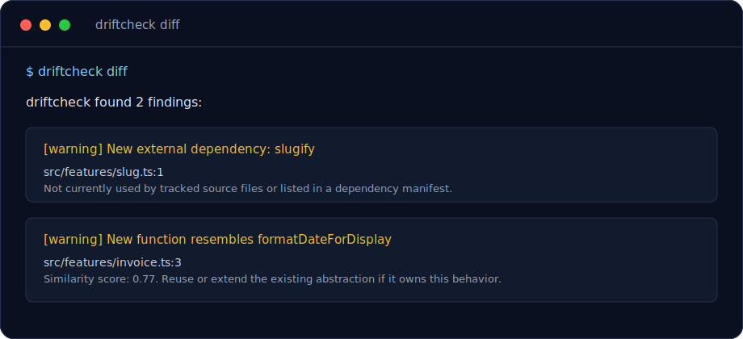

# driftcheck

[](https://github.com/sxuff/driftcheck/actions/workflows/ci.yml)
[](LICENSE)
[](package.json)
[](https://www.typescriptlang.org/)

`driftcheck` is a local-first semantic linter for AI-generated code. It analyzes staged changes or a git diff and flags when new code drifts away from the existing codebase.

Today it detects duplicated abstractions, undeclared dependency drift, and nearby convention drift. Longer term, it aims to catch architecture violations from repo docs, ADRs, and import boundaries.

The MVP is local-first and focused on TypeScript/JavaScript, Python, and Rust repositories.



## Why

AI agents are fast at producing code, but they often miss the quiet social contract of a codebase: existing utilities, naming habits, dependency choices, test style, and folder conventions.

`driftcheck` looks at the code that is already there, then reviews your changed files for drift before those changes become permanent.

## Features

- Detects new functions/classes/types that resemble existing abstractions.
- Flags undeclared external dependencies introduced by changed files.
- Learns nearby conventions for quotes, semicolons, exports, function style, error handling, and test/source placement.
- Works locally on real git diffs and staged changes.
- Supports text output for humans and JSON output for CI.
- Starts with JavaScript/TypeScript, Python, and Rust.

## Quick Start

```bash
npm install
npm run build
```

During development:

```bash
npm run dev -- diff
```

To use the `driftcheck` binary name locally before publishing:

```bash
npm run build
npm link
driftcheck diff
```

You can also run the compiled CLI directly:

```bash
node dist/cli.js diff
```

## Usage

Analyze unstaged working tree changes:

```bash
driftcheck diff
```

Analyze staged changes:

```bash
driftcheck staged
```

Build a lightweight map of existing repo patterns:

```bash
driftcheck scan
```

Emit JSON for CI experiments:

```bash
driftcheck staged --json
```

## What It Checks

- **Similar declarations**: newly added functions/classes are compared with existing declarations using AST-style extraction and token similarity.
- **New dependencies**: new external imports are compared with existing imports, `package.json`, `pyproject.toml`, `requirements.txt`, `Cargo.toml`, and local naming signals. By default, driftcheck reports undeclared external packages rather than every new use of an already-declared dependency.
- **Convention drift**: changed files are compared with nearby files for quote style, semicolons, export style, function style, error handling, and basic source/test placement.

Findings include severity, path, line number when possible, explanation, and a suggested fix.

## Example

```text
driftcheck found 1 finding:

[warning] New function resembles formatDateForDisplay
  src/features/invoice.ts:1
  formatDateForInvoice looks semantically similar to formatDateForDisplay in src/utils/date.ts:1. Similarity score: 0.63.
  Suggestion: Reuse or extend the existing abstraction if it owns this behavior; otherwise rename or narrow the new code so the distinction is obvious.
```

## Architecture

The CLI is split into small modules:

- `src/git.ts`: git diff, staged diff, tracked file discovery.
- `src/scan.ts`: repository pattern map.
- `src/analyzers/typescript.ts`: TypeScript/JavaScript AST extraction.
- `src/analyzers/python.ts`: lightweight Python declaration/import extraction.
- `src/analyzers/rust.ts`: lightweight Rust declaration/import extraction.
- `src/driftcheck.ts`: MVP drift rules.
- `src/reporters.ts`: text and JSON output.

Language support is intentionally isolated so Python and Rust analyzers can be added later without changing the command surface.

## Roadmap

- Configuration file for thresholds and ignored rules.
- Better semantic similarity using embeddings or local symbol graphs.
- Framework-aware conventions for React, Next.js, Node services, and test runners.
- Tree-sitter-backed analyzers for richer multi-language parsing.
- Architecture rules from project docs, ADRs, and import boundaries.
- CI annotations for GitHub Actions.
- npm publishing with GitHub Actions trusted publishing.

## Development

```bash
npm test
npm run typecheck
npm run lint
npm run build
npm run check
```
